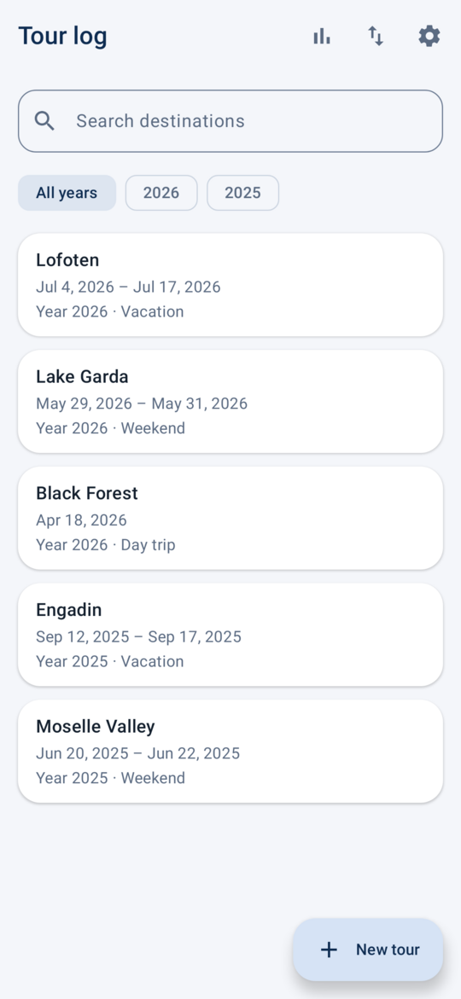
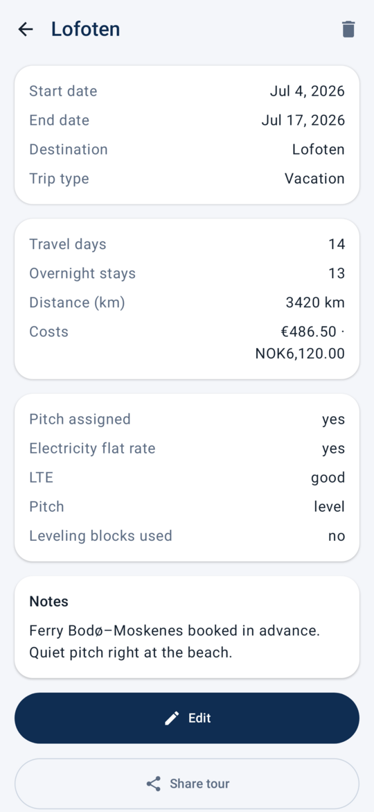
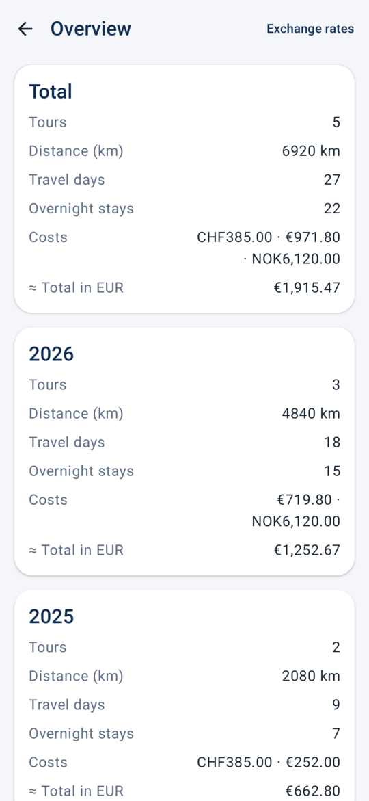
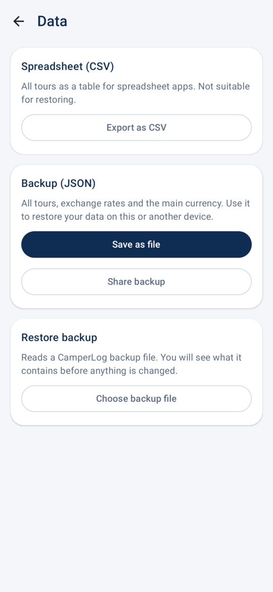

<p align="center"></p>

# CamperLog

CamperLog is an Android app for recording camper trips, their costs, and the currencies they were paid in. It is built with Kotlin, Jetpack Compose, and Room. The app uses English by default and German on devices configured for German. CSV export keeps its existing column names and values for compatibility with earlier exports.

<p align="center">
  
  
  
  
</p>

## Features

- **Tour log:** destination, dates, tour type (day trip, weekend, vacation), distance, overnight stays, and costs; searchable and filterable by year.
- **Multiple currencies:** costs keep their original currency and precision (e.g. `1450.00 NOK`, `3500 ISK`); amounts are entered in your device's number format.
- **Overview:** tours, distance, travel days, overnight stays, and costs per currency, in total and per year; optionally converted into a main currency using exchange rates you maintain yourself.
- **Export:** all tours as CSV for spreadsheet apps, protected against formula injection.
- **Backup and restore:** a JSON file with all tours, exchange rates, and the main currency; the import shows a preview before changing anything.
- **Light and dark theme**, following the system by default.

## Getting started

1. Download the latest `CamperLog-*.apk` from [Releases](https://github.com/DeveloperAsAService/CamperLog/releases) and optionally compare it with the published SHA-256 checksum. Release APKs are built for **arm64** devices running **Android 8.0 or newer**.
2. Open the APK on your phone and allow installing apps from this source when Android asks. Later releases install as updates and keep your data.
3. Tap **New tour** to record your first trip. Under **Settings → Manage exchange rates**, choose a main currency and enter rates if you want converted totals.

**Privacy:** CamperLog requests no permissions and has no network access. All data stays on your device until you export or share it yourself. Uninstalling the app deletes its data, so save a backup regularly (**Data → Backup**), for example before switching phones.

## Development

Requirements: JDK 17, Android SDK (platform 37), and an Android device or emulator to run the app. The Gradle wrapper is included.

```sh
./gradlew :app:testDebugUnitTest :app:lintDebug :app:assembleDebug
```

Pushes to `master` and pull requests run these checks in [GitHub Actions](.github/workflows/ci.yml). Debug APKs are not published as releases.

`scripts/update-screenshots.sh` regenerates the README screenshots in `docs/screenshots/` from sample data (Robolectric, no device needed). Run it after visible UI changes; the screenshot test is skipped in normal test runs.

## Versions and releases

The sole version declaration is `appVersion` in `app/build.gradle.kts`; Android's `versionCode` is derived from it. Release regularly, e.g. after each completed set of user-visible changes, so the published APK stays current. For each release, increment the version (SemVer; `MINOR` and `PATCH` must each be below 100), commit the changes, and tag the **commit on `master`** with `v<version>`. Push the branch before the tag:

```sh
git push github master
git tag -a v1.0.4 -m 'CamperLog 1.0.4' # Example: after bumping to the next unused version
git push github v1.0.4
```

The [release workflow](.github/workflows/release.yml) verifies the version, tag, and branch, runs tests and lint, builds a signed arm64 APK, verifies its signature, and publishes it with a SHA-256 checksum. A release fails if signing secrets are missing or invalid. Treat published tags as immutable: increment the version for fixes rather than moving a tag.

### Signed APK (arm64)

For local builds, follow `keystore.properties.example` and **keep a permanent, secure backup of the keystore**. `scripts/build-release-arm64.sh --no-install` builds a signed APK without installing it. Replacing the signing key prevents updating existing installations while retaining their data.

To publish an installable APK, configure both repository secrets under **Settings → Secrets and variables → Actions**:

- `RELEASE_KEYSTORE_BASE64`: Base64-encoded content of the permanently backed-up release keystore.
- `RELEASE_PROPERTIES_BASE64`: Base64-encoded `keystore.properties` with `storeFile=release.jks`, `storePassword`, `keyAlias`, and `keyPassword` for that keystore.

On Linux, use `base64 -w0 camperlog-release.jks` and `base64 -w0 keystore.properties`, then enter the respective outputs directly as secrets. The properties file encoded for GitHub **must** contain `storeFile=release.jks`. Never commit the keystore or passwords.

## License

Apache License 2.0; see [LICENSE](LICENSE).
