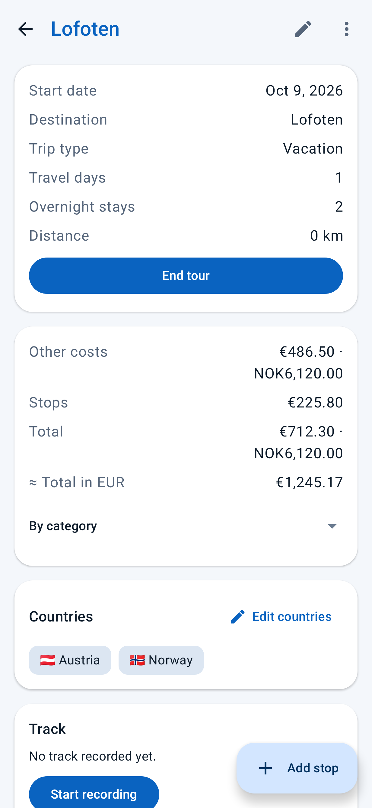
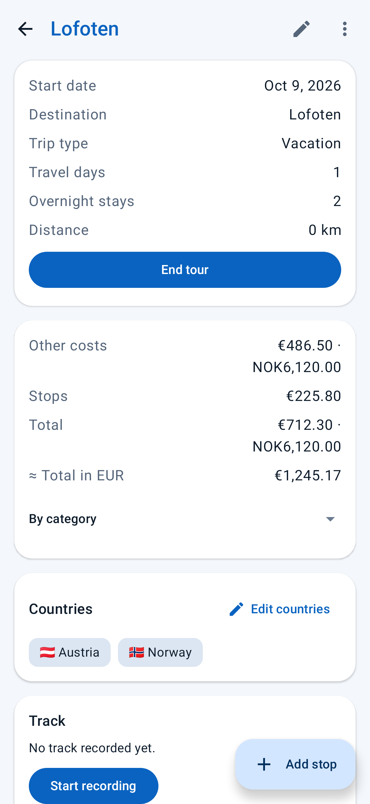
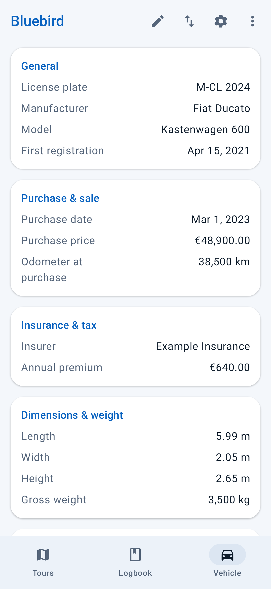
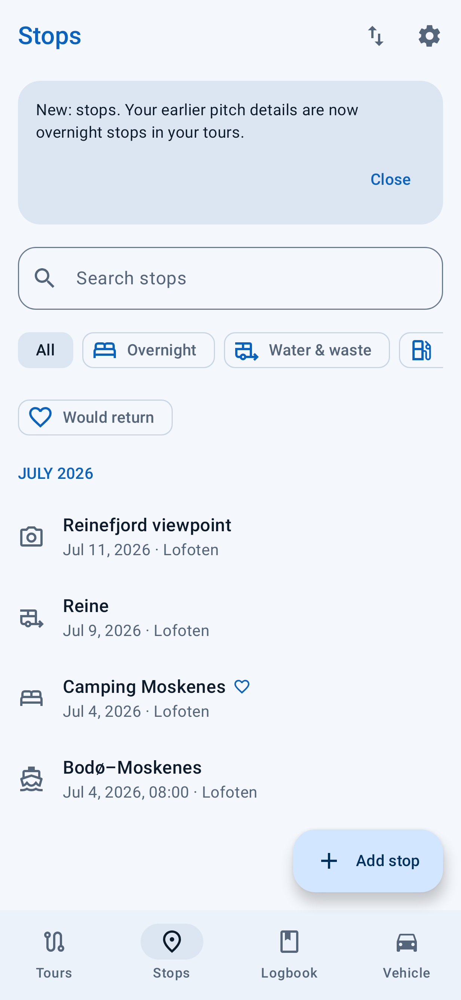

# CamperLog

CamperLog helps you record camper trips, stops, costs, vehicle details and maintenance. The app works offline; location, track recording, maps, weather and reminders are optional.

  
  
  
  
  

## Features

- Record tours, daily notes, stops, countries, distances and costs in multiple currencies.
- Record a tour's track with optional location access. View it on the map and include it in GPX exports.
- Keep details for multiple vehicles, maintenance, repairs, documents and a logbook.
- Add photos, checklists and reminders.
- Search your records, view totals and export tours or stops as CSV. Export a tour as a ZIP with HTML, Markdown, GPX, CSV and photos.
- Back up and restore your data, including photos and documents.

## Get started

Install CamperLog from [F-Droid](https://f-droid.org/packages/app.restvolt.camperlog/) or download the latest APK from [GitHub Releases](https://github.com/noctunix/CamperLog/releases). Android 8.0 or newer is required.

Add your camper in the **Vehicle** tab, then create a tour in **Tours**. To record a route, open the tour and start **Track recording**; Android will ask for location permission. You can choose the recording interval in Settings. Recording runs with a persistent notification, resumes automatically if the device restarts while it is running, and stops when you stop it.

CamperLog keeps data on your device. Optional weather and map features use Open-Meteo and OpenStreetMap. Notifications are optional and run a daily local check. Three supporting permissions are granted at installation without a prompt: reminder checks and an active track recording resume after a restart, and the device is briefly kept awake. Back up your data before uninstalling or changing phones (**Data → Backup**).

## License

Apache License 2.0; see [LICENSE](LICENSE).
